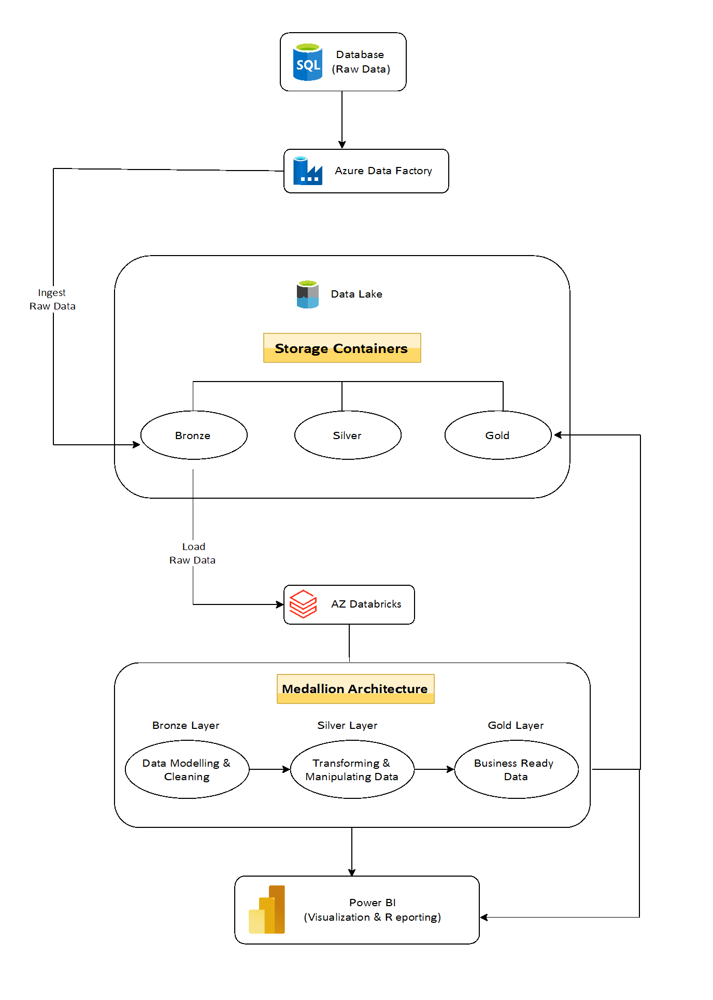
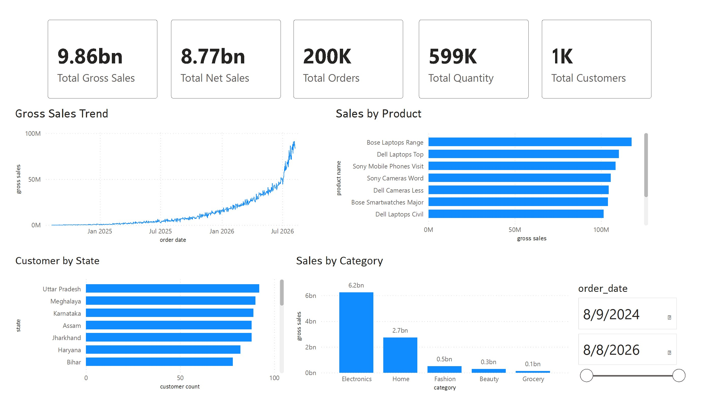
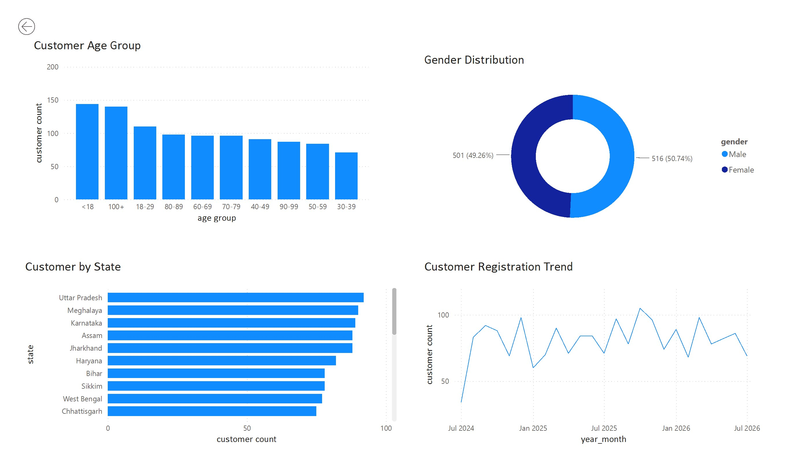
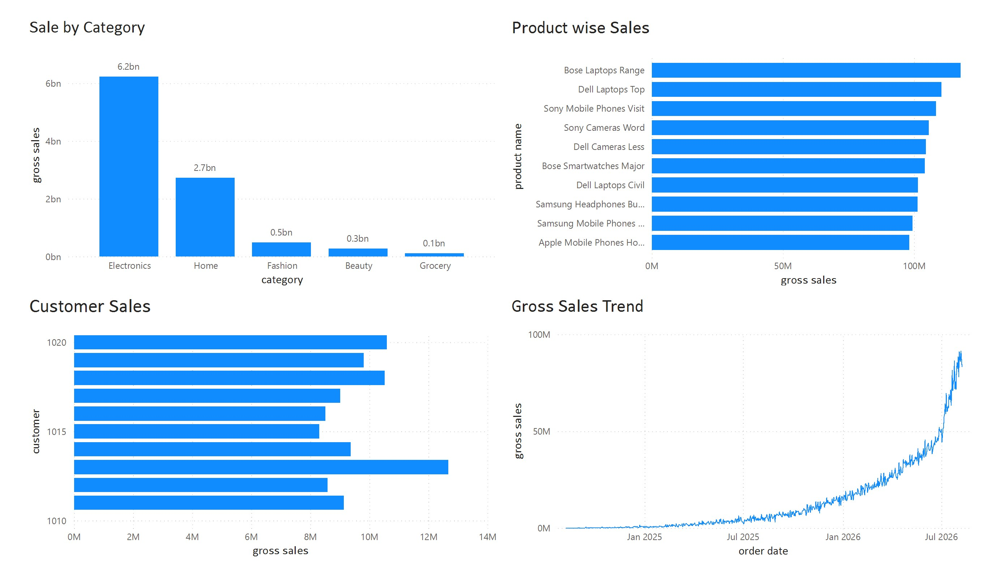

# Retail Sales Lakehouse 

## Project Overview

The project implements a cloud-based retail data platform that transforms
raw transactional data into business-ready analytical datasets.

The platform follows a Medallion Architecture consisting of Bronze, Silver,
and Gold layers.

Raw data is ingested into the data lake through Azure Data Factory,
processed and transformed using Azure Databricks, and stored as
business-ready datasets in the Gold layer.

The Gold datasets are consumed by Power BI to provide interactive
customer and sales analytics.

An end-to-end Azure Data Engineering project designed to ingest, process,
transform, validate, and visualize retail sales data using a modern
lakehouse architecture.

## Github Folder Structure

RETAIL_SALES_LAKEHOUSE_PLATFORM
│
├── architecture/
│   ├── Retail_Sales.drawio
│   └── Retail_Sales.jpg
│
├── datasets/
│   ├── customer_data/
│   ├── orders_data/
│   └── products_data/
│
├── docs/
│   └── RETAIL SALES LAKEHOUSE PLATFORM.docx
│
├── notebooks/
│   ├── customers/
│   ├── orders/
│   └── products/
│
├── visualization/
│   ├── Retail_Sales_Analysis.pbix
│   └── Retail_Sales_Analysis.pdf
│
└── README.md

## Architecture

## Technology Stack

- Azure Database for PostgreSQL
- Azure Data Factory
- Azure Data Lake Storage Gen2
- Azure Databricks
- PySpark
- SQL
- Power BI
- Git & GitHub

## Key Engineering Work

- Designed an end-to-end Azure-based lakehouse architecture.
- Implemented data ingestion using Azure Data Factory.
- Stored data using a Bronze/Silver/Gold Medallion Architecture.
- Processed and transformed datasets using Azure Databricks and PySpark.
- Generated business-ready analytical datasets in the Gold layer.
- Performed data validation and reconciliation of processed datasets.
- Built Power BI dashboards for customer and sales analysis.
- Implemented interactive filtering and KPI-based reporting.

## Power BI Dashboard

### Executive Dashboard

### Customer Analysis

### Sales Analysis

